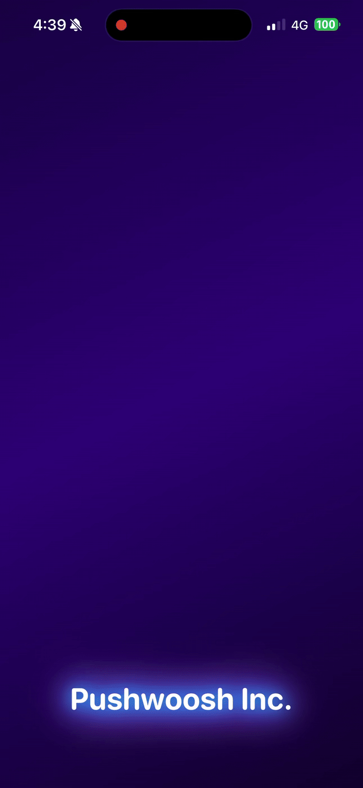

# Custom Banner Support for iOS Push Notifications

This sample demonstrates how to implement rich, interactive custom banners in iOS push notifications using Notification Content Extension.

## How It Looks on Device

<p align="center">
  
</p>

*This is how the custom notification banner appears on a real iOS device when you long-press the notification.*

## Features

- **Rich Visual Experience**: Full-screen background image with elegant gradient overlay
- **Interactive UI**: Two action buttons ("View Details" and "Later") with modern styling
- **Smart Layout**: Title and body text positioned over the image with shadows for readability
- **Thumbnail Support**: Small thumbnail in collapsed notification (via `ios_attachment`)
- **Custom Expanded View**: Beautiful custom UI when notification is expanded via long press
- **Automatic Fallback**: Shows text content if image loading fails

## Implementation

### 1. Notification Content Extension Setup

The project includes a `ContentExtension` target with:

- `NotificationViewController` - Handles incoming notifications
- `PushwooshContentExtensionHelper` - Helper class for loading and displaying images

### 2. Usage in NotificationViewController

```swift
func didReceive(_ notification: UNNotification) {
    PushwooshContentExtensionHelper.handleContentExtension(
        request: notification.request,
        in: self
    ) { success in
        if !success {
            // Fallback to showing text if image loading failed
            self.label?.text = notification.request.content.body
        }
    }
}
```

### 3. Payload Structure

The `ios_expanded_image_url` should be placed inside the `aps` object:

```json
{
  "aps": {
    "alert": {
      "title": "Pushwoosh",
      "body": "Your favorite items are now 50% OFF! Limited time offer - grab them before they're gone!"
    },
    "mutable-content": 1,
    "category": "myNotificationCategory",
    "ios_expanded_image_url": "URL"
  },
  "ios_attachment": "URL"
}
```


### 4. Pushwoosh API Integration

When using Pushwoosh `/createMessage` API:

```json
{
  "request": {
    "application": "XXXXX-XXXXX",
    "auth": "XXXXX",
    "notifications": [
      {
        "title": "Pushwoosh",
        "ios_content": "Your favorite items are now 50% OFF! Limited time offer - grab them before they're gone!",
        "ios_root_params": {
          "aps": {
            "mutable-content": 1,
            "category": "myNotificationCategory",
            "ios_expanded_image_url": "URL"
          }
        },
        "ios_attachment": "URL"
      }
    ]
  }
}
```

**Important**: The `ios_expanded_image_url` must be placed inside `ios_root_params.aps` object.

## How It Works

1. **Notification Arrives**: Push notification with `mutable-content: 1` is received
2. **Notification Service Extension**: Downloads thumbnail image from `ios_attachment` (handled by standard iOS mechanism)
3. **User Expands**: User performs long press on notification
4. **Content Extension Loads**: `NotificationViewController.didReceive()` is called
5. **Helper Extracts Data**: `PushwooshContentExtensionHelper` extracts `ios_expanded_image_url`, title, and body from payload
6. **Image Loading**: Helper asynchronously downloads image from URL
7. **Rich UI Display**: Creates beautiful UI with:
   - Full-screen background image
   - Gradient overlay (transparent at top, darker at bottom)
   - Title and body text with shadows
   - Two styled action buttons at the bottom

## UI Components

- **Background Image**: Full-screen image with `scaleAspectFill` content mode
- **Gradient Overlay**: Smooth gradient from 30% to 70% black opacity
- **Title**: 28pt bold white text with shadow
- **Body**: 16pt regular white text with shadow
- **Action Buttons**:
  - "View Details": Primary button with white background and black text
  - "Later": Secondary button with transparent background and border

## Key Components

### PushwooshContentExtensionHelper

Public API:
```swift
public static func handleContentExtension(
    request: UNNotificationRequest,
    in viewController: UIViewController,
    completion: @escaping (Bool) -> Void
)
```

Features:
- Extracts `ios_expanded_image_url`, title, and body from notification payload (from `aps` object)
- Asynchronously loads image via URLSession
- Creates rich UI with:
  - Full-screen background image
  - Gradient overlay for better text readability
  - Title and body labels with shadows
  - Two styled action buttons
- Clean, modern design with Auto Layout
- Handles errors gracefully with completion callback

### Configuration in Info.plist

The `ContentExtension/Info.plist` should have:

```xml
<key>NSAppTransportSecurity</key>
<dict>
    <key>NSAllowsArbitraryLoads</key>
    <true/>
</dict>
<key>NSExtension</key>
<dict>
    <key>NSExtensionAttributes</key>
    <dict>
        <key>UNNotificationExtensionCategory</key>
        <string>myNotificationCategory</string>
        <key>UNNotificationExtensionInitialContentSizeRatio</key>
        <real>1</real>
        <key>UNNotificationExtensionDefaultContentHidden</key>
        <true/>
        <key>UNNotificationExtensionUserInteractionEnabled</key>
        <false/>
    </dict>
    <key>NSExtensionMainStoryboard</key>
    <string>MainInterface</string>
    <key>NSExtensionPointIdentifier</key>
    <string>com.apple.usernotifications.content-extension</string>
</dict>
```

**Important keys:**
- `UNNotificationExtensionCategory` - Must match the category in push payload (default: `myNotificationCategory`)
- `UNNotificationExtensionDefaultContentHidden` - Hide default notification body (set to `true` for custom UI)
- `NSAllowsArbitraryLoads` - Allow loading images from HTTP/HTTPS URLs

## Testing

### Using Console Script

Save as `send_test_notification.sh`:

```bash
#!/bin/bash

curl -X POST https://api.pushwoosh.com/json/1.3/createMessage \
  -H "Content-Type: application/json" \
  -d '{
    "request": {
      "application": "XXXXX-XXXXX",
      "auth": "XXXXX",
      "notifications": [{
        "title": "Pushwoosh",
        "ios_content": "Your favorite items are now 50% OFF! Limited time offer - grab them before they'\''re gone!",
        "ios_root_params": {
          "aps": {
            "mutable-content": 1,
            "category": "myNotificationCategory",
            "ios_expanded_image_url": "URL"
          }
        },
        "ios_attachment": "URL"
      }]
    }
  }'
```

### Manual Testing

1. Build and run the app on a physical device
2. Send a push with the payload structure above (use descriptive title and body for best visual effect)
3. Long press on the notification
4. Verify the rich UI:
   - Full-screen background image
   - Gradient overlay
   - Title and body text visible and readable
   - Two action buttons at the bottom

### Tips for Best Results

- Use high-quality images (at least 800x600px)
- Write descriptive titles and body text
- Test with different image aspect ratios
- The gradient ensures text is always readable over the image

## Migration Guide for Existing Apps

If you already have a Notification Service Extension for Rich Media:

1. Add Notification Content Extension target to your project
2. Copy `PushwooshContentExtensionHelper.swift` to your ContentExtension
3. Update `NotificationViewController.swift` to call the helper
4. Configure `Info.plist` with the category identifier
5. Update your push payloads to include `ios_expanded_image_url`

## Requirements

- iOS 10.0+
- Xcode 14.0+
- Physical device for testing (push notifications don't work in Simulator)

## License

Copyright © 2025 Pushwoosh. All rights reserved.
